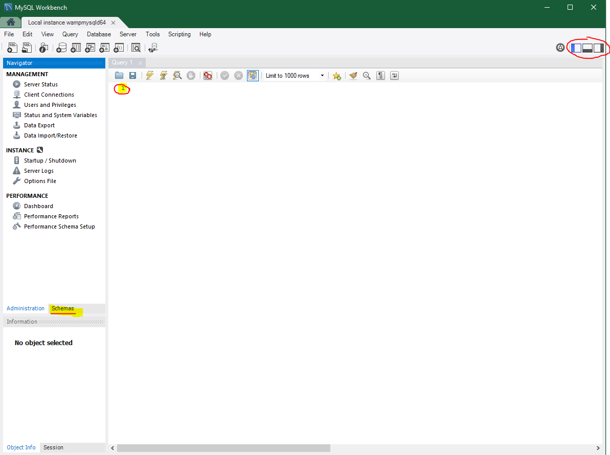

#### Menu
- [Usando o MySQL Workbench?](#usando-o-mysql-workbench)
- [Tipos Primitivos dos Dados](#tipos-primitivos-dos-dados)

### Usando o MySQL Workbench?

Agora com o WAMP Server instalado, abra-o.Espere o simbolo ficar verde (*Wzinho*).

Após o WAMP Server estar aberto e funcionando, abra o MySQL Workbench você observará que já estará aparecendo uma instância local do WAMP Server(**Local Instance Wampmysql**). 

Após clicar nessa instância será aberto o **novo Workbench**.

Nesse momento você deve estar visualizando uma imagem como .

Pouco a pouco entenderemos essa tela.Note as três regiões em destaque na imagem:
1. No **lado esquerdo** temos uma opção chamada **Schemas**, nela podemos visualizar nosso banco.
2. Na **região central**(número 1) temos o nosso quadro, será nessa região que digitaremos os nossos comandos em SQL.
3. No **lado superior direito** temos o ícone com três janelinhas, podemos usá-las para esconder as abas abertas na tela.

### Tipos Primitivos dos Dados

As informações armazenadas no banco de dados podem ser de diferentes tipos e de diferentes precisões. Dimensionar bem um banco de dados é uma características fundamental do programador, então fique atento nas informações abaixo. 

No **MySQL** esses tipos são divididos em famílias que por sua vez podem ser subdivididas. As principais famílias, subdivisões e suas respectivas precisões podem ser visualizar na lista abaixo:

Tipo   | Subdivisão | Precisão*
:---------:|:------:|:------:
Numérico   | Inteiro| TinyInt, SmallInt(1 bytes), Int, MediumInt, BigInt
   --       | Real   | Decimal, Float, Double, Real
   --       | Lógico | Bit, Boolean
Data e Tempo|   --       | Date,DateTime, TimeStamp, Time, Year
Literais    |Binário| TinyBlob, Blob, MediumBlob, LongBlob
   --       | Texto (texto longo)| -
   --       |Caracter (texto curto)|Char(fixo) e VarChar(variante)
   --       |Coleção| Enum, Set      
Espacial    |   --       | Geometry, Point, Polygon, MultiPolygon

>*A precisão de cada um dos tipos pode ser consultada [aqui](https://medium.com/mandabugs/mysql-tipos-de-dados-introdu%C3%A7%C3%A3o-e-dados-num%C3%A9ricos-1-de-3-a6e48fb5e1d3) e [aqui](https://dev.mysql.com/doc/refman/8.0/en/data-types.html).
> - Exemplo : o tinyint comprende a valores entre -128 a 127 e consome apenas 1 byte.

volte para o [inicio desse artigo](#inicio)

