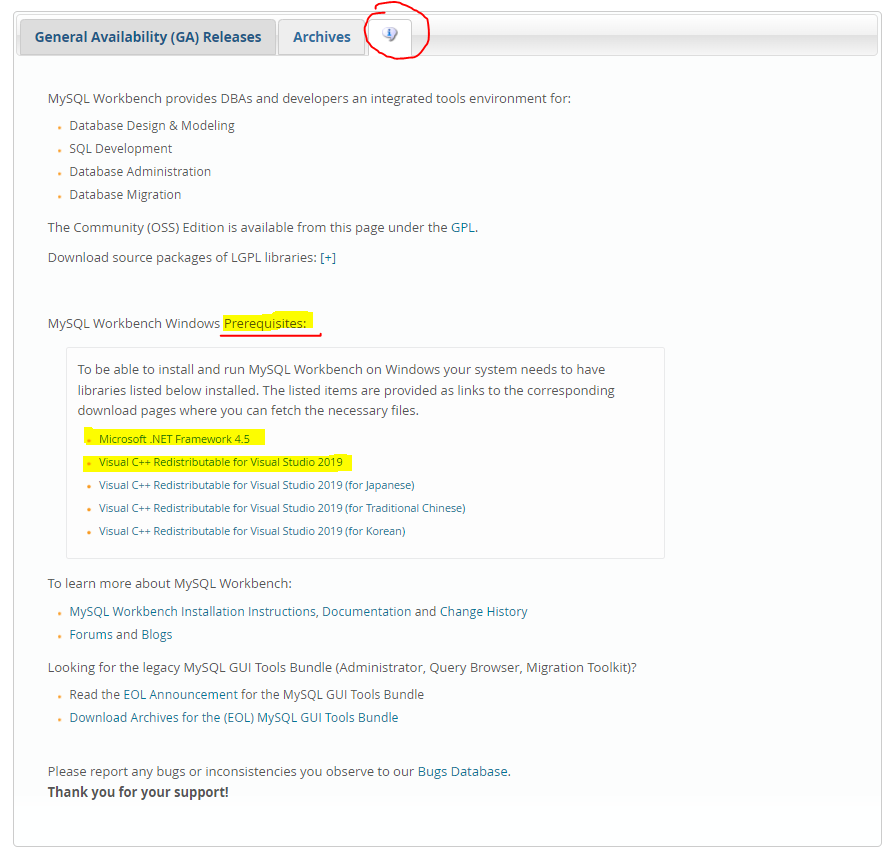

#### Menu

- [O que é o MySQL Workbench?](#o-que-é-o-mysql-workbench)
- [Onde baixar o MySQL Workbench?](#onde-baixar-o-mysql-workbench)
- [Instalando o WAMP Server](#instalando-o-wamp-server)

### O que é o MySQL Workbench?

O **MySQL** é um sistema gerenciador de banco de dados relacional de código aberto usado na maioria das aplicações gratuitas para gerir suas bases de dados. O MySQL utiliza a linguagem SQL (Structure Query Language – Linguagem de Consulta Estruturada), que é a linguagem mais popular para inserir, acessar e gerenciar o conteúdo armazenado num banco de dados.

### Onde baixar o MySQL Workbench?

Para fazer o download desse Gerenciador de Banco de Dados:

1. Entre no site do [MySQL](https://www.mysql.com/products/workbench/) na opção **Products**;
2. Procure a opção **Workbench** (menu do lado esquerdo);
3. Clique na opção de [Download Now](https://dev.mysql.com/downloads/workbench/);
4. A nova aba que abriu apresenta a versão proposta para o seu sistema operacional. Faça o download, mas observe que na terceira aba(com um balão com a letra i dentro) é necessário cumprir alguns pré-requisitos.
   
   
5. Antes de instalar o **MySQL**, baixe e instale os pré-requisitos:
    - Instale o [.NET Framework 4.5](https://www.microsoft.com/en-us/download/details.aspx?id=30653);
    - Instale o [Visual C++ Redistributable for Visual Studio 2019](https://visualstudio.microsoft.com/downloads/?q=Visual+C%2B%2B+Redistributable+for+Visual+Studio+2019);

> Se os pré-requisitos não forem instalados primeiro, não será possível instalar o Gerenciador de Banco de Dados, MySQL.

### Instalando o WAMP Server

O WAMP Server pode ser usado como servidor Web em seu computador ou, até mesmo, de um ambiente de desenvolvimento Web para fazer testes.
Ele é um aplicativo que instala um ambiente de desenvolvimento Web no Windows. Com ele, você pode criar aplicações Web com Apache2, PHP e banco de dados MySQL. 

1. Baixando o [WAMP Server](https://www.wampserver.com/en/)
2. Após abrir o WAMP Server, observe se seu símbolo(uma letra W) ficou verde, na barra inferior do Windows próximo ao relógio. Se sim, tudo está certinho. Agora clique no ícone e abra o **MySQL console**.

   Será aberto uma caixa de diálogo, com o login do usuário **root** sua senha é vazia, dessa forma será necessário apenas pressionar enter na tela de console que aparece com o nome ``password``. Em seguida você já pode pressionar os comandos do MySQL, para testar digite ``status`` e tecle enter.

Use o **Worbench** caso o terminal não sejá sua preferência.
> Fique ligado nos pré-requisitos, pode ser que necessite de algum deles. A instalação do WAMP pode demorar um pouco pois ele irá instalar o Apache, PHP e o MySQL.

>**ATENÇÃO**
> Se você não conseguiu instalar o WAMP Server por favor assista o vídeo abaixo para aprender a instalar outra opção chamada [XAMPP](https://www.youtube.com/watch?v=R2HrwSQ6EPM).

> Fonte: Techtudo

volte para o [inicio desse artigo](#inicio)