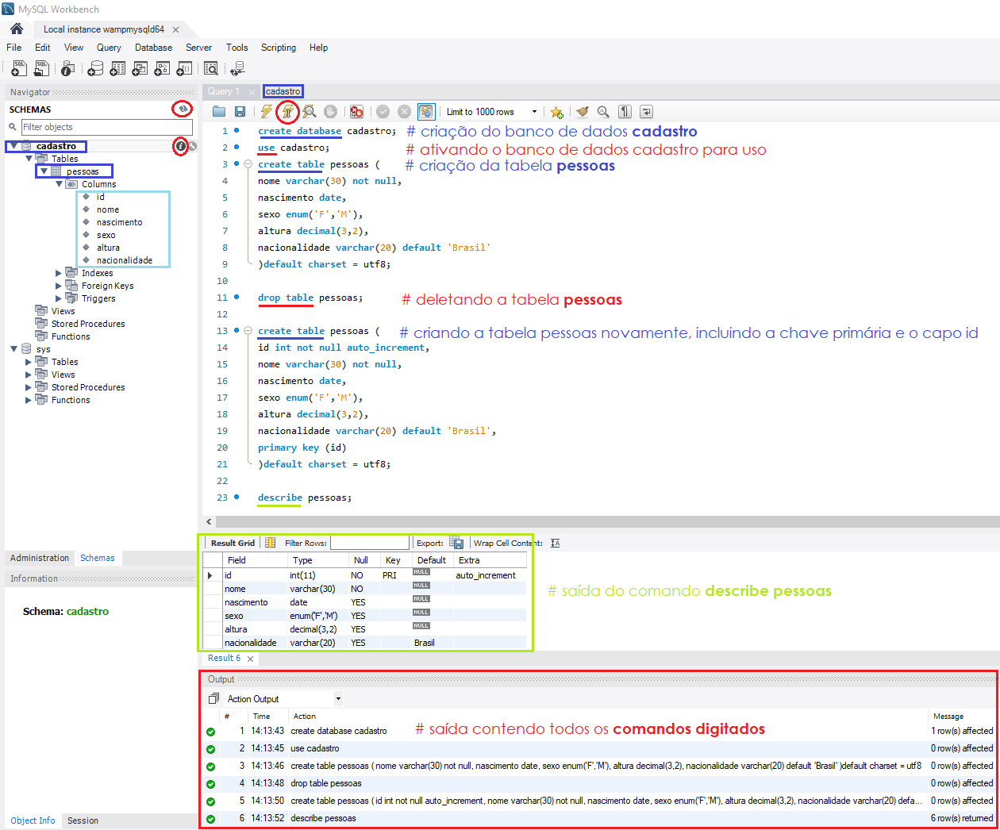
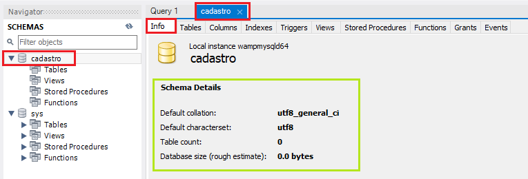
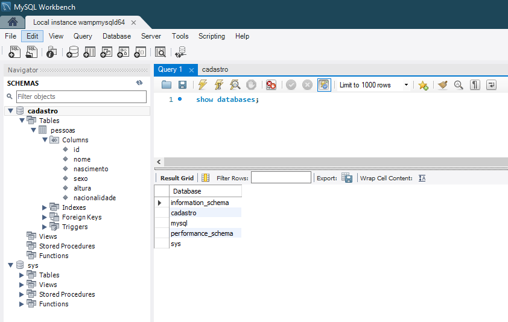
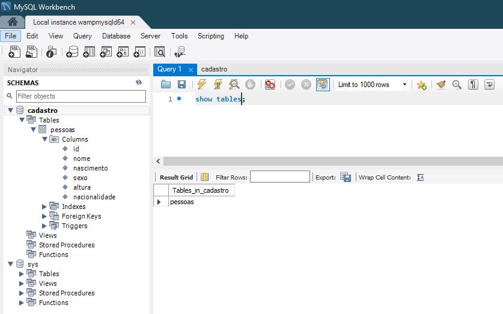

### Prática para criação do Banco de Dados
Os comandos abaixo foram usados como teste para criação de um banco de dados chamado **cadastro**.

1. Criando o banco de dados chamado *cadastro*
```sql
create database cadastro 
default character set utf8 
default collate utf8_general_ci;
```


2. Abrindo ou ativando o banco de dados para uso

Antes de usar um banco de dados criado é necessário ativá-lo para uso, através do comando ``use``.

```sql
use cadastro;
```

3. Criando uma tabela chamada *pessoas*

```sql
create table pessoas(
id int not null auto_increment
nome varchar(30) not null, 
nascimento date,
sexo enum('M','F'),
peso decimal(5,2),
altura decimal(3,2)
nacionalidade varchar(20) default 'Brasil'
primary key (id)
)default charset = utf8;
```

Observe que:

- No exemplo acima passamos a informação do **nome** como um valor que não pode de maneira nenhuma ficar nulo *(not null)*, ou seja, precisará receber um valor em qualquer situação.
- O **sexo** foi passado como um valor que só poderá receber dois tipos de informação, são eles: *M ou F* que representam, masculino e feminino, respectivamente.Note que coloquei esse valores em maiúsculo ou seja na hora de digitar ele só aceitará nesse formato. 
- No **peso** passamos o valor *5,2*, representando que o peso informado pode ter até 5 casas decimais ao todo, sendo 3 delas antes da virgula e duas depois, imagine por exemplo esse campo sendo preenchido com o valor *102,35 kilos*.
- Na **altura** podemos colocar qualquer valor com no máximo três casas decimais, sendo 1 antes da vírgula e duas depois, uma vez que ninguém terá mais que 9 metros de altura (risos). Nessa situação serão usados valores como, 1,58 metros ou 2,20 metros.
- Na **nacionalidade** colocamos que devem ser recebidos o máximo 20 caracteres e que seu valor padrão, caso nada seja digitado, será preenchido com *Brasil*. Então, se a nacionalidade não foi informada manualmente, esse campo será automaticamente preenchido com o valor *Brasil*.
  
Após o **último elemento não deve-se usar virgula** pois isso causará um erro.

> **IMPORTANTE:**
> Uma observação importante sobre o comando anterior é que nenhum dos dados digitados pode ser usado para identificar uma pessoa como única dentro do banco de dados, se você estudou a parte de integridade dos dados, sabe que isso é feito por meio da utilização da **chave primária**, para corrigir esse problema criaremos um campos ou um registro usado especificamente para identificar (**``id``**) as pessoas cadastradas na tabela criada no exemplo anterior. Esse campo será definido como nossa chave primária, ele será numérico (**``int``**), não nulo (**``not null``**) e auto-incrementável (**``auto_increment``**). Esse campo será definido através do comando **``primey key (nome_do_campo_criado_como_chave_primaria)``**.
    

4. Apagando banco de dados ou tabela: 
`drop database cadastro;` e/ou `drop table pessoas;`

Visão geral do resultado a partir dos passos aplicados anteriormente:



Note os pontos em destaque:
 - a **região central**, onde aparece o número 1, foi a região onde digitamos o comando para criação do banco de dados; 
 - Para executar o comando, clique no **ícone do raio** logo acima do comando digitado;
 - **Para verificar** se o comando foi executado com sucesso, note a instrução que aparece na aba localizada na parte **inferior da tela***(create database cadastro)*;
 - Na **aba da lateral esquerda**, na porção superior, existe um ícone utilizado para atualizar o sistema. Clique nele e note que aparecerá o novo banco de dados criado, que chamamos de **cadastro**;
 - Você pode visualizar as informações do cadastro e das tabelas clicando no símbolo do *Izinho* ao lado do nome cadastro ou da tabela pessoas na barra de navegação




5. Para verificar qual banco de dados está sendo utilizado via terminal siga o caminho *wampserver > MYSQL > Console MYSQL > ``enter`` na tela do root > ``enter`` na tela do password* e digite o comando `status;`


6. Visualizando os bancos de dados criados, via ambiente gráfico
`show databases;`



7. Visualizando das tabelas existentes, via ambiente gráfico:
`show tables;`




> *Note1:* Os comandos demostrados aqui são os mesmos, tanto para o ambiente gráfico como para o console do MySQL (aberto via ícone do Wampserver).

> *Note2:* Para abrir o console, clique no simbolo do ``Wampserver > MySQL > MySQL Console``, para fechar digite ``exit`` e tecle enter. 