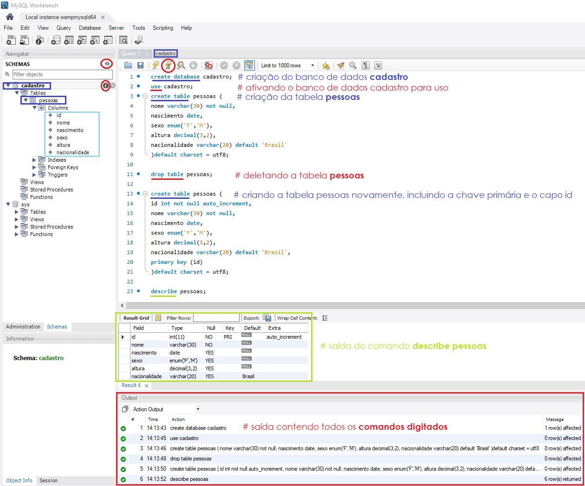
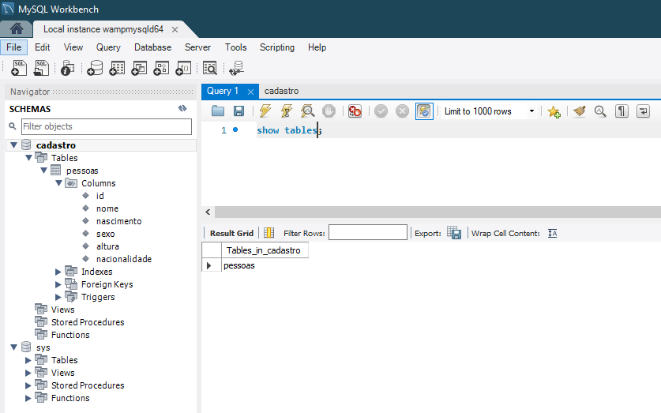

### Prática de criação do Banco de Dados - Parte 1

Os comandos abaixo foram usados como teste para criação de um banco de dados chamado **cadastro**. O principal objetivo desse banco é armazenar um cadastro de diferentes pessoas com seus respectivos dados pessoais.

#### Conceitos Importantes

- Tuplas = linhas ou registros
- Coluna =  campo ou atributos


#### Comandos iniciais

1. Criando o banco de dados chamado *cadastro*
```sql
create database cadastro 
default character set utf8 
default collate utf8_general_ci;
```

2. Abrindo ou ativando o banco de dados para uso

Antes de usar um banco de dados criado é necessário ativá-lo para uso, através do comando ``use``.

```sql
use cadastro;
```

3. Criando uma tabela chamada *pessoas*

```sql
create table pessoas(
id int not null auto_increment,
nome varchar(30) not null, 
nascimento date,
sexo enum('M','F'),
peso decimal(5,2),
altura decimal(3,2),
nacionalidade varchar(20) default 'Brasil',
primary key (id)
)default charset = utf8;
```

Observe que:

- No exemplo acima passamos a informação do **nome** como um valor que não pode passar de 30 letras e de maneira nenhuma ficar nulo *(not null)*, ou seja, precisará receber um valor em qualquer situação.
- O **sexo** foi passado como um valor que só poderá receber dois tipos de informação, são eles: *M ou F* que representam, masculino e feminino, respectivamente.Note que coloquei esse valores em maiúsculo ou seja na hora de digitar ele só aceitará nesse formato. 
- No **peso** passamos o valor *5,2*, representando que o peso informado pode ter até 5 casas decimais ao todo, sendo 3 delas antes da virgula e duas depois, imagine por exemplo esse campo sendo preenchido com o valor *102,35 kilos*.
- Na **altura** podemos colocar qualquer valor com no máximo três casas decimais, sendo 1 antes da vírgula e duas depois, uma vez que ninguém terá mais que 9 metros de altura (risos). Nessa situação serão usados valores como, 1,58 metros ou 2,20 metros.
- Na **nacionalidade** colocamos que devem ser recebidos o máximo 20 caracteres e que seu valor padrão, caso nada seja digitado, será preenchido com *Brasil*. Então, se a nacionalidade não foi informada manualmente, esse campo será automaticamente preenchido com o valor *Brasil*.
  
Após o **último elemento não deve-se usar virgula** pois isso causará um erro.

> **IMPORTANTE:**
> Uma observação importante sobre o comando anterior é que nenhum dos dados digitados pode ser usado para identificar uma pessoa como única dentro do banco de dados, se você estudou a parte de integridade dos dados, sabe que isso é feito por meio da utilização da **chave primária**, para corrigir esse problema criaremos um campos ou um registro usado especificamente para identificar (**``id``**) as pessoas cadastradas na tabela criada no exemplo anterior. Esse campo será definido como nossa chave primária, ele será numérico (**``int``**), não nulo (**``not null``**) e auto-incrementável (**``auto_increment``**). Esse campo será definido através do comando **``primey key (nome_do_campo_criado_como_chave_primaria)``**.
    

4. Apagando banco de dados ou tabela: 
`drop database cadastro;` e/ou `drop table pessoas;`

Visão geral do resultado a partir dos passos aplicados anteriormente:



Note os pontos em destaque:
 - a **região central**, onde aparece o número 1, foi a região onde digitamos o comando para criação do banco de dados; 
 - Para executar o comando, clique no **ícone do raio** logo acima do comando digitado;
 - **Para verificar** se o comando foi executado com sucesso, note a instrução que aparece na aba localizada na parte **inferior da tela***(create database cadastro)*;
 - Na **aba da lateral esquerda**, na porção superior, existe um ícone utilizado para atualizar o sistema. Clique nele e note que aparecerá o novo banco de dados criado, que chamamos de **cadastro**;
 - Você pode visualizar as informações do cadastro e das tabelas clicando no símbolo do *Izinho* ao lado do nome cadastro ou da tabela pessoas na barra de navegação


5. Para verificar qual banco de dados está sendo utilizado via terminal siga o caminho *wampserver > MYSQL > Console MYSQL > ``enter`` na tela do root > ``enter`` na tela do password* e digite o comando `status;`


6. Visualizando os bancos de dados criados, via ambiente gráfico
`show databases;`


7. Visualizando das tabelas existentes, via ambiente gráfico:
`show tables;`



8. Visualizando uma tabela específica
`describe pessoas;` ou `desc pessoas;`

#### Cadastrando dados no nosso banco

A inserção dos dados no banco segue um padrão simples, onde os valores devem estar entre parenteses. Cada valor deve ser inserido entre aspas simples e separado dos demais por vírgula, como mostrado nesse exemplo:
```mysql
('valor1','valor2','valor3');
```

1. Inserindo as pessoas na tabela **pessoas** do nosso banco de dados **cadastro** a partir do comando ``insert into``:

Ao criarmos a tabela pessoas descrevemos os seguintes itens para preenchimento: id, nome, nascimento,sexo, peso, altura, nacionalidade.
Nos passos seguintes você observará diversas formas distintas e corretas para a inserção de valores na nossa tabela.

O primeira dado cadastrado na tabela **pessoas** será o do nosso amigo *BOB ESPONJA*
```sql
insert into pessoas
(id,nome, nascimento,sexo, peso, altura, nacionalidade)
values
('1','Bob Esponja', '1999-05-01','M','16.25','1.30','Estados Unidos');
```
Para executar: `ctrl + enter`

No exemplo acima, o cadastro no valor id foi desnecessário, uma vez que esse campo está descrito como não nulo e auto-incrementável, dessa forma posso ignorar essa informação como no exemplo abaixo:


O segunda será *Irmão do Jorel*
```sql
insert into pessoas
(nome, nascimento,sexo, peso, altura, nacionalidade)
values
('Irmão do Jorel', '2014-10-22','M','15.52','1.10','Brasil');
```
Para executar: `ctrl + enter`

Os campos id e nacionalidade podem ser preenchidos usando a opção **default**, dessa forma será adicionado o valor padrão, definido durante a criação da tabela, para esse campo.

O terceiro será *Peixonauta*
```sql
insert into pessoas
(id, nome, nascimento,sexo, peso, altura, nacionalidade)
values
(default,'Peixonauta', '2018-04-20','M','8.50','0.60',default);
```
Para executar: `ctrl + enter`

Ignorando os valores que receberão valores padrão para preenchimento durante a criação da tabela.

O quarto será *Lara*
```sql
insert into pessoas
(nome, nascimento,sexo, peso, altura)
values
('Lara','2014-05-15','F','16.52','1.25');
```
Para executar: `ctrl + enter`

Perceba que estamos **inserindo todos os valores na mesma ordem dos campos criados na tabela**, nesse caso, sempre que estivemos inserindo valores na mesma ordem dos campos não precisamos inserir o nome deles novamente e o comando será reduzido para:

Inserindo o quinto será *Luna*
```sql
insert into pessoas values
(default,'Luna','2014-08-16','F','20.50','1.45',default);
```
Para executar: `ctrl + enter`

Agora que já treinamos, posso te ensinar uma forma mais rápida para adicionar vários dados de uma vez só, observe o exemplo abaixo:

Inserindo vários registro em um mesmo comando
```sql
insert into pessoas values
(default,'Lisa Simpsons','1981-05-9','F','25.50','1.20','Estados Unidos'),
(default,'Fry','1974-08-14','M','50.42','1.60','Estados Unidos');
```
Para executar: `ctrl + enter`


2. Para visualizar os dados digitados na tabela, use o comando: ``select * from pessoas;`` e para executar pressione `ctrl + enter`


#### Realizando alterações na tabela (``Alter Table`` - modificando colunas)

Para realizar qualquer alteração relacionada a estrutura da tabela, precisamos usar o comando ``alter table nome_da_tabela`` acompanhado com a alteração que deseja ser feita.

Para nosso exemplo, iremos inserir um novo campo chamado **profissao**. Usaremos esse campo para adicionar a informação sobre a profissão dos nossos registros.

1. Adicionando uma coluna ou um novo campo na nossa tabela (coluna = campo no MySQL) através do comando =: ``add column nome_do_campos`` ou ``add nome_do_campos``

    ```sql
    alter table pessoas
    add column profissao varchar(10);
    ```
    ou
    ```sql
    alter table pessoas
    add rofissao varchar(10);
    ```

A coluna **profissao** receberá um texto com no máximo 10 caracteres, se precisarmos de mais podemos mudar esse parâmetro.

Note que na imagem a coluna **profissoes** foi inserida no final e esse é o comportamento padrão.


> **Lembre-se:** Para ver as modificações na tabela use o botão de atualizar, localizado na parte superior da barra de navegação.


Podemos inserir um novo campo na nossa tabela em **três posições distintas**, são elas:
 - no início da tabela
    ```sql
    alter table pessoas
    add column codigo int first ;
    ```
 - após um outro campo já existente, a partir da especificação deste
    ```sql
    alter table pessoas
    add column profissao varchar(10) not null default '' after nome;
    ```
    Nesse caso usei como referência o campo **nome** que foi criado no inicio junto com nossa tabela **pessoas**
- na última posição, que é a forma padrão
    ```sql
    alter table pessoas
    add column profissao varchar(10) not null default '';
    ```
A constraint ``not nul default ''`` vai criar o campo não nulo porém preenchido com valores vazios.

Se desejarmos colocar essa coluna em outra posição precisaremos apagá-la primeiro e então realizar uma das mudanças mostradas acima.

2. Elimindando/ deletando uma coluna da tabela através do comando: 
 
    ```sql
    alter table pessoas
    drop column profissao;
    ```


No exemplo acima eu adicionei a coluna profissao utilizando a maneira padrão, depois apaguei e criei duas colunas (código e profissao), código como primeira coluna da tabela e profissao depois da coluna nome.

3. Alterando a estrutura dos dados como, o tipo do campo e as constraints com o comando ``modify``

O comando modify só não pode ser usado para renomear a coluna, mas para outras modificações como por exemplo aumentar a quantidade de caracteres (de 10 para 20) recebidos e tornar o campo criado não nulo.

```sql
alter table pessoas
modify column profissao varchar(20) not null default '';
```

Essa modificação vai aumentar os caracteres recebidos de 10 para 20.

4. Modificando o nome, as constraints e o tipo primitivo usando o comando: `change column nome_da_coluna_antigo nome_da_coluna_novo tipo constraints`

Vou mudar o nome da coluna **codigo** para **cod**
```sql
alter table pessoas
change column codigo cod int;
```


5. Renomeando a tabela com o : ``rename to``

```sql

alter table pessoas
rename to usuarios;
```


#### Criando uma nova tabela usando condições ainda não exista (``if not exists`` or ``if exists``)

O ``if not exists`` é um parâmetro do **create** que permite criar uma tabela ou banco de dados *caso ele ainda não exista*. O mesmo serve para apagar, só será apagado caso exista utilizando o ``if exists`.` Seu uso, diminui as chances de sobrescrever alguma tabela ou banco de dados já existente.

   1. Criando uma nova tabela a partir do parâmetro ``if not exists``:
```sql
create table if not exists cursos(
nome varchar(30) not null unique,
descricao text,
carga int unsigned,
tot_aulas int unsigned,
ano year default '2016'
) default charset = utf8;
```

Recapitulando:

No exemplo acima foram usadas algumas *constraint*, vamos entender um pouco sobre cada uma delas:

- **not null:** especifica que o campo não pode ficar nulo;
- **unique:** indica que não pode haver dois registros do mesmo campo com o mesmo nome;
- **unsignet (sem sinal):** indica que não serão aceitos valores negativos
- **default:** especifica que se o valor não for cadastrado será preenchido pela informação indicada entre '' presente logo após o termo default.

2. Modificando a tabela com a criação e definição da chave primária

- Criando o campo idcursos como primeiro campo da tabela
  
    ```sql
    alter table cursos
    add column idcurso int first;
    ```
- Atribuidno a chave primária ao campo idcursos

    ```sql
    alter table cursos
    add primary key (idcrusos);
    ```


> **ATENÇÃO:**
> O conceito de **chave primária e diferente de Unique**. A chave primária também é única mais compreende a outros conceitos.


> *Note1:* Os comandos demostrados aqui são os mesmos, tanto para o ambiente gráfico como para o console do MySQL (aberto via ícone do Wampserver).

> *Note2:* Para abrir o console, clique no simbolo do ``Wampserver > MySQL > MySQL Console``, para fechar digite ``exit`` e tecle enter. 