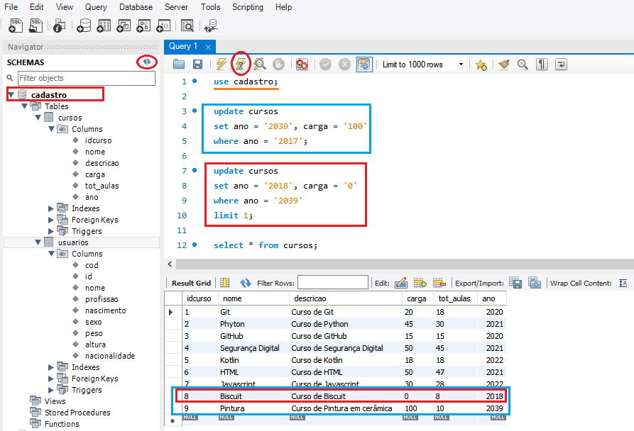

### Prática de criação do Banco de Dados - Parte 2

- [Inserindo dados em uma tabela - modificando linhas)](#ancora1)
    - [Incluindo novos registros (`insert into`)](#ancora1a)
    - [Modificando linhas e corrigindo erros (``update/set/where``)](#ancora1b)
    - [Modificando valores em múltiplas colunas ao mesmo tempo (``update/set/where``)](#ancora1c)
    - [Desabilitando o Save Update do MySQL](#ancora1d)
    - [Usando a cláusula LIMIT (``update/set/where/limit``)](#ancora1e)
    - [Como excluir o conteúdo de linhas específicas (``update/set/where``)](#ancora1f)


Até esse momento, criei duas tabelas (usuarios e cursos). 
A tabela de cursos ainda não possui nada inserido nela e para modificar essa realidade usaremos o comando ``insert to`` para começar a manipular linhas.

<a id="ancora1"></a>
#### Inserindo dados em uma tabela (``Insert into`` - modificando linhas)

<a id="ancora1a"></a>
1. Incluindo novos registros para os campos criados na tabela **cursos** (idcurso, nome, descricao, carga, tot_aulas, ano).

    ```sql
    insert into cursos values
    ('1','Git','Curso de Git','20','18','2020'),
    ('2','Phyton','Curso de Python','45','30','2021'),
    ('3','GitHub','Curso de GitHub','15','15','2020'),
    ('4','Segurança Digital','Curso de Segurança Digital','50','45','2021'),
    ('5','Kotlin','Curso de Kotlin','18','18','2022'),
    ('6','HTML','Curso de HTML','50','47','2021'),
    ('7','Javascript','Curso de Jarbascript','30','28','2021');
    ```
De propósito inseri alguns informações erradas como, **Pyhton ao invés de Python** e **jarbascript no lugar de javascript**,além disso o ano do curso de javascritp deve ser corrigido para **2022** logo iremos corrigir.


<a id="ancora1b"></a>
2. Modificando as linhas e corrigindo os erros com o comando ``update / set / where``:
   
Para identificar qual valor desejamos alterar precisamos indicar a linha e a coluna onde ele se encontra. 
Nesse caso quero **corrigir o nome Python** que esta na **coluna nome** e para **referenciar a linha, usarei a chave primária idcurso = 2**, uma vez que só existe uma linha onde o idcurso é igual a 2.

```sql
update cursos
set nome = 'Python'
where idcurso = '1';
```

Note na imagem que, essa alteração só pode ocorrer no campo nome da tabela na linha onde o idcurso é igual a 2, ou seja na segunda linha.

Agora eu quero corrigir a descrição do curso de Javascript juntamente do seu ano, de 2021 para 2022.

<a id="ancora1c"></a>
**Como posso alterar mais de um valor localizado em colunas diferentes ao mesmo tempo?**

```sql
update cursos
set descricao = 'Curso de Javascript', ano = '2022'
where idcurso = '7';
```


Para entender como o comando UPDATE pode ser perigoso irei inserir mais duas linhas na nossa tabela **cursos** para fazermos um teste.

```sql
insert into cursos values
('8','Biscuit','Curso de Biscuit','10','8','2017'),
('9','Pintura','Curso de Pintura em cerâmica','15','10','2017');
```


Agora, usando o comando `update / set / where` modificarei o campo **ano dos cursos para 2039** assim como o campo **carga para 100**, porém ao invés de usar a chave primária para identificação da linha, realizarei a modificação em todos os registros que possuam o campo **ano = 2017**. 

```sql
update cursos
set ano = '2039', carga = '100'
where ano = '2017';
```


A imagem acima revela que eu não consegui realizar a modificação devido ao modo seguro em que o MySQL está trabalhando. Essa é uma ferramenta de proteção que bloqueia a alteração em mais de uma linha caso não seja utilizado com parâmetro a chave primária. 

<a id="ancora1d"></a>
Para fazer esse teste, irei desabilitá-la** temporariamente seguindo o caminho ``Edit > Preferences > SQL Editor > **Safe Updates** > OK > Reconecte o banco de dados`` clicando no ícone mostrado na figura abaixo. 

Recomendo habilitá-la após a execução desse teste.


Agora, com ela desmarcada irei executar novamente o comando: 

```sql
update cursos
set ano = '2039', carga = '100'
where ano = '2017';
```

A imagem abaixo mostra que foi possível fazer a alteração na carga e no ano de todos os cursos que antes possuíam o valor do campo ano = 2017. Essa é minha tabela resultante.


<a id="ancora1e"></a>
Para diminuir esse perigo podemos usar a cláusula **``limit``**, com ela podemos restringir a quantidade de linhas que queremos que sejam afetadas pela modificação, veja o exemplo:

```sql
update cursos
set ano = '2018', carga = '0'
where ano = '2039'
limit 1;
```

Essa comando irá alterar, considerando o limite = 1, ou seja apesar de existir duas linhas que se enquadram no ano = 2039, ele só alterará uma para 2018. 

Nesse caso, ele começará a leitura de cima para baixo. A linha modificada será apenas a primeira com o campo *ano = 2039*.




Como já dito anteriormente a inserção das linhas com idcurso = 8 e 9 foram realizadas apenas para teste, agora aprenderemos a apagar essas linhas

<a id="ancora1f"></a>
#### Como posso excluir o conteúdo de linhas específicas ?

```sql
update cursos
set ano = '2018', carga = '0'
where ano = '2039'
limit 1;
