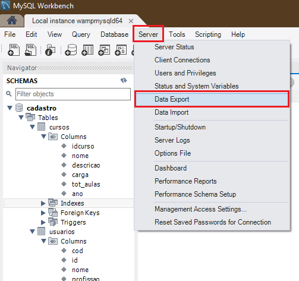
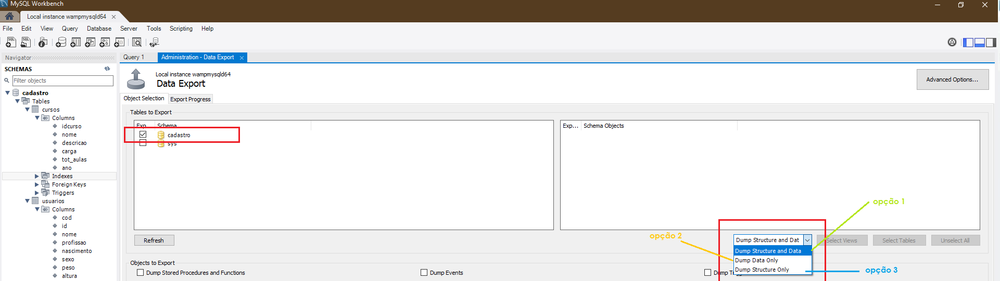
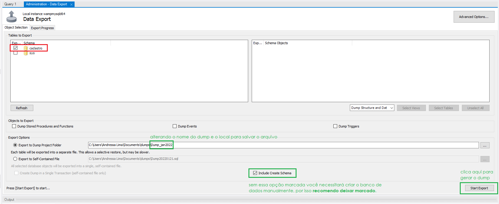
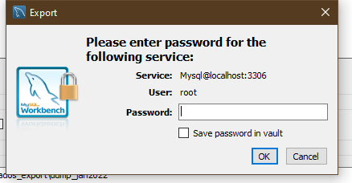
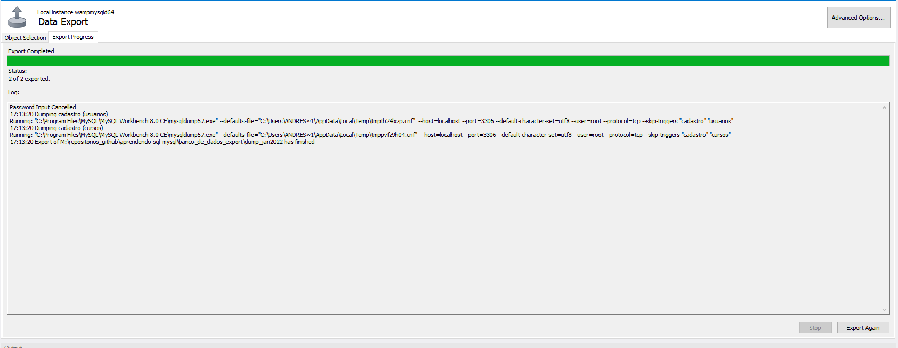
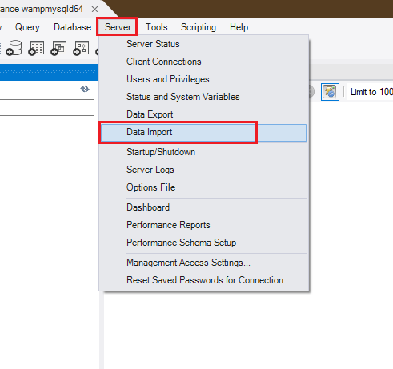
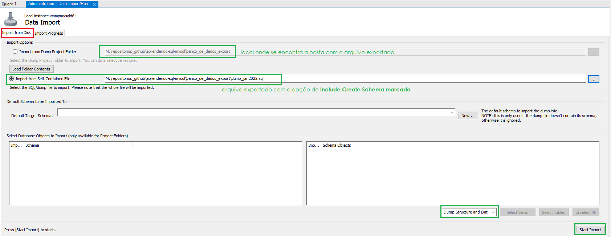

<a id="inicio"></a>

#### Menu
- [Realizando Backup do nosso Banco de Dados no MySQL](#realizando-backup-do-nosso-banco-de-dados-no-mysql)
  - [Exportando o Banco de Dados ``cadastro``](#exportando-o-banco-de-dados-cadastro)
  - [Importando o Banco de Dados `cadastro`](#importando-o-banco-de-dados-cadastro)

<a id="ancora1"></a>
## Realizando Backup do nosso Banco de Dados no MySQL

Para realizar o backup do seu banco de dados no MySQL Workbench você necessitará exportar uma cópia do projeto, ou seja fazer um **DUMP** e para isso siga os passos abaixo:


### Exportando o Banco de Dados ``cadastro``

1. No MySQL Workbench selecione a opção **Server** presente no menu superior;
2. Na sequência, escolha a opção **Data Export**;
   
3. Escolha qual banco de dados deseja ser exportado (selecionei o banco de dados *cadastro*) e qual tipo de exportação você deseja fazer, existem três opções no MySQL:
- Exportando a estrutura do banco de dados com todos as informações já registradas (opção 1)
- Exportando apenas as informações (opção 2)
- Exportando apenas a estrutura do banco de dados (opção 3)
  
  Selecionei a opção 1 pois desejo exportar tudo.

   
4. Na opção **Export do Dump Project Folder**,escolha o local para salvar seu backup assim como o nome que você desejar
5. Marque a opção **Include Create Schema**, dessa maneira não será necessário crias seu banco ;de dados novamente através do comando ``Create database``;
6. Para exportar o arquivo, finalize clicando na opção **Start Export**

   

>**ATENÇÃO**
Se durante essa etapa apareceu um erro como esse na sua tela:


Pare o que está fazendo e siga os passos descritos [nesse arquivo](8.correcao-erro-exportacao.md), depois que executá-los pode voltar para continuar o processo de exportação. Boa sorte! ;)


7. No MySQL o próximo passo será pedir a senha do servidor, nesse caso estou usando o Wampserver, sendo assim o **usuário padrão é root** e a **senha é vazia**, ou seja só pressionar *enter* ou clicar no **oK**

    

8. Agora sua exportação está sendo concluida e seu arquivo logo aparecerá dentro da pasta especificada:
    

9. Você pode abrir seus arquivos exportados por meio do **Bloco de Notas** vai notar que nele estarão todos os

### Importando o Banco de Dados `cadastro`

Antes de testar a importação do banco de dados `cadastro` utilizei o comando ``drop database cadastro;`` para apagar completamente o nosso banco de dados.

```sql
drop database cadastro;
```

Pronto, tudo certinho para realizar a importação. Vamos começar!

Siga os passos abaixo:

1. Navegue até a opção **Server > Data Import**, no menu superior para abrir as opções de importação do Banco de Dados:


2. Siga as instruções da imagem abaixo:
 


Selecione a opção **Start Import** para finalização a importação

3. Finalizando a importação


4. Agora você só precisa atualizar seu banco e os dados importados irão aparecer:


5. Testando para verificar se tudo está correto como antes:
   


> Note:
> O banco de dados **cadastro** exportado nessa atividade pode ser encontrando neste [diretório](banco_de_dados_export\dump_jan2022.sql);


> **Lembre-se:**
> Para executar as instruções pressione sobre a linha do comando as teclas ``ctl + enter``.

volte para o [inicio desse artigo](#inicio)
