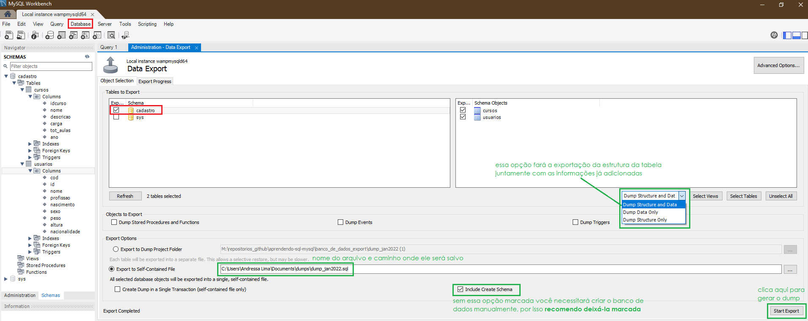

#### Menu

 - [Realizando Backup do nosso Banco de Dados no MySQL](#ancora1)

### Realizando Backup do nosso Banco de Dados no MySQL

Para realizar o backup do seu banco de dados no MySQL Workbench você necessitará exportar uma cópia do projeto, ou seja fazer um **DUMP** e para isso siga os passos abaixo:

1. No MySQL Workbench selecione a opção **Server** presente no menu superior;
2. Na sequência, escolha a opção **Data Export**;
   
3. Escolha qual banco de dados deseja ser exportado (selecionei o banco de dados *cadastro*) e qual tipo de exportação você deseja fazer, existem três opções no MySQL:
- Exportando a estrutura do banco de dados com todos as informações já registradas (opção 1)
- Exportando apenas as informações (opção 2)
- Exportando apenas a estrutura do banco de dados (opção 3)
  
  Selecionei a opção 1 pois desejo exportar tudo.

   
4. Na opção **Export do Dump Project Folder**,escolha o local para salvar seu backup assim como o nome que você desejar
5. Marque a opção **Include Create Schema**, dessa maneira não será necessário crias seu banco ;de dados novamente através do comando ``Create database``;
6. Para exportar o arquivo, finalize clicando na opção **Start Export**

   

>**ATENÇÃO**
Se durante essa etapa apareceu um erro como esse na sua tela:

Pare o que está fazendo e siga os passos descritos [nesse arquivo](8.correcao-erro-exportacao.md), depois que executá-los pode voltar para continuar o processo de exportação. Boa sorte! ;)

7. No MySQL o próximo passo será pedir a senha do servidor, nesse caso estou usando o Wampserver, sendo assim o **usuário padrão é root** e a **senha é vazia**, ou seja só pressionar *enter* ou clicar no **oK**

    

8. Agora sua exportação está sendo concluida e seu arquivo logo aparecerá dentro da pasta especificada:
    

volte para o [inicio desse artigo](#inicio)
