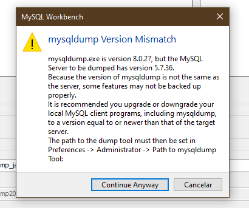
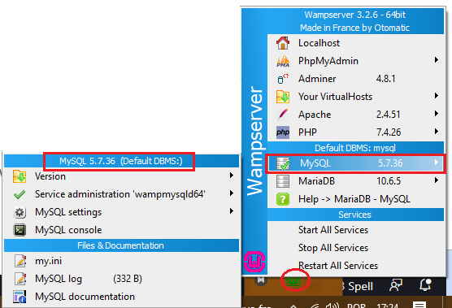
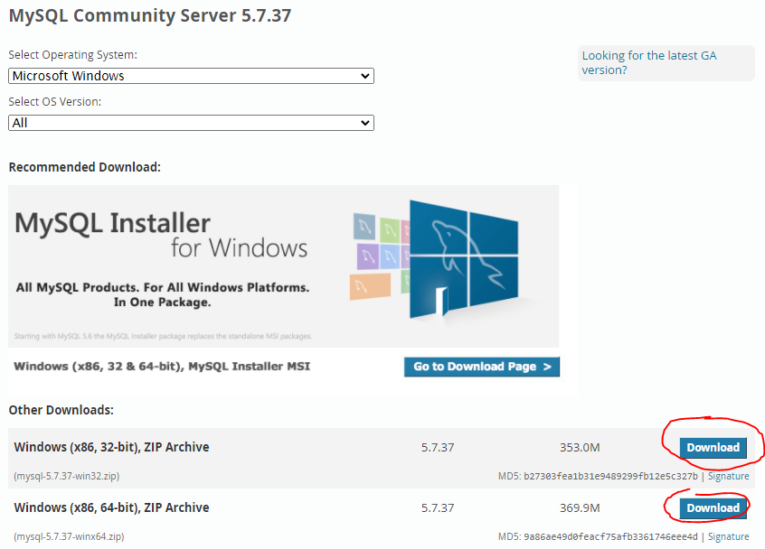
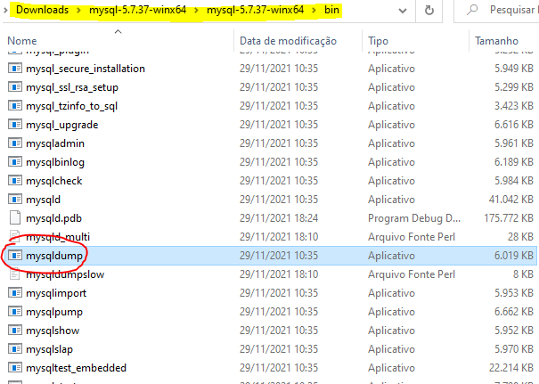
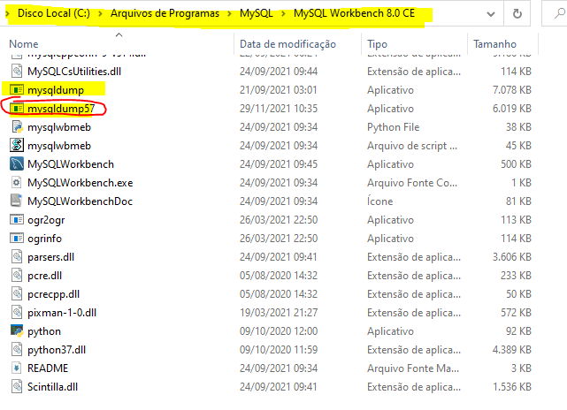
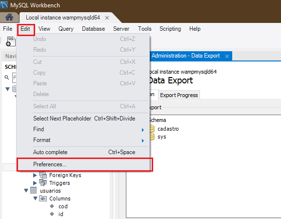
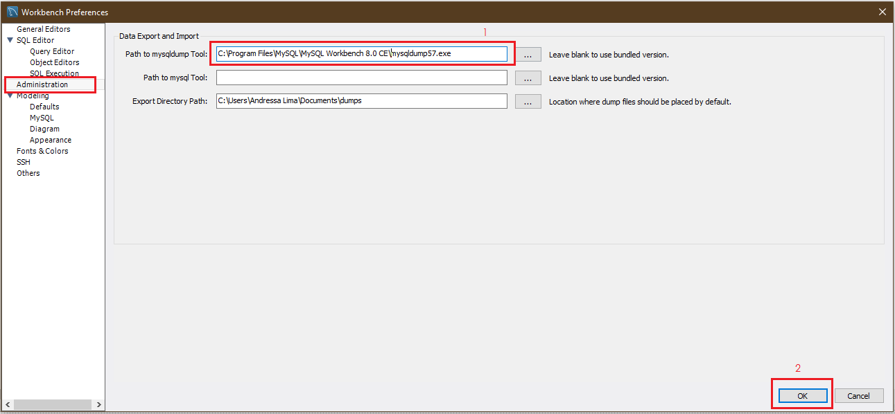

### Corrigindo erro de incompatibilidade de versões entre servidor e PATH do Dump no MySQL

Se você está aqui é porque infelizmente deu de cara com esse erro durante o processo de exportação do Dump, correto?

#### Porque ele ocorreu?

Esse erro ocorre por **dois motivos**:
 - A versão entre o servidor MySQL é diferente da versão do mysqldump que compõe a versão 8 do MySQL Workbench. A versão do servidor, como mostrada na página do wampserver e clicando sobre seu ícone, é a versão 5.7.36 e do Workbench é 8.

- Como os arquivos são incompatíveis o **PATH** ou o caminho do arquivo mysqldump.exe não está sendo aceito ou pode não ter sido especificado.

#### Como corrigir o problema?

A solução mostrada abaixo pode ser usada para contornar o problema momentaneamente, para isso siga os passos abaixo:

1. Baixe a versão mais antiga do MySQL, a versão 5.7 [nesse link](https://dev.mysql.com/downloads/mysql/5.7.html#downloads);
Escolha a versão que mais se adequa a seu sistema operacional.

2. Descompacte o arquivo zip baixado, com a descompactação concluida navegue até a pasta **/bin** e dentro dela procure o arquivo com o nome **mysqldump.exe**.

3. Ainda dentro da pasta ``/bin`` da versão 5.7 do MySQL renomeie o arquivo, falado anteriormente, **mysqldump** para **mysqldump57** e o copie.

4. Procure o local de instalação do MySQL Workbench 8 no seu computador, geralmente fica na pasta ``C:\Program Files\MySQL\MySQL Workbench 8.0 CE``, mas isso pode variar. Agora cole o arquivo **mysqldump57** dentro dessa pasta.

5. Agora vamos copiar o caminho do **mysqldump57.exe** para colocar na configuração do **PATH** do MySQL Workbench 8.

Siga o caminho especificado nas figuras abaixo:

Prontinho, agora basta seguir os passos abaixo para conseguir exportar seu banco.

Na opção **Server > Data Export** selecione os campos em vermelho na ordem apresentada:

   

volte para o artigo sobre exportação [clicando aqui](7.realizando-backup-mysql.md)