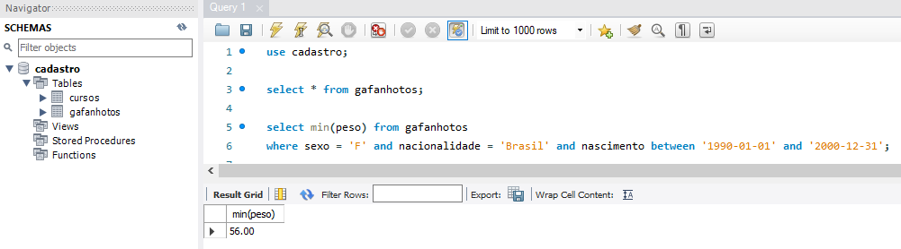
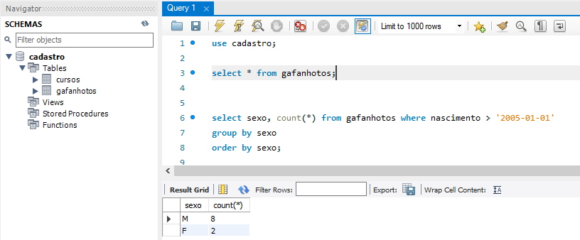

### Exercícios

As questões apresentadas abaixo foram elaboradas pelo professor **Gustavo Guanabara** e disponibilizadas através do **Curso em Vídeo**. 

O banco de dados usado para solucionar as questões se encontra [aqui](arquivos-exercicios/dump_cursoemvideo.sql).


1. Selecionar uma lista com o nome de todas as alunas;

Para realizar esse exercício, precisei filtrar todos os dados da tabela ``Gafanhotos`` que tinham o campo ``sexo = 'F'``, para finalizar eu ordenei a apresentação dos dados pelo nome(A-Z).


```sql
select nome from gafanhotos
where sexo = 'F'
order by nome;
```

Confira a resposta na imagem abaixo:


2. Lista com os dados de todos aqueles que nasceram entre 1/jan/2000 e 31/dez/2015;

```sql
select * from gafanhotos
where nascimento between '2000-01-01' and '2015-12-31'
order by nome, nascimento;
```

Confira a resposta na imagem abaixo:


3. Lista com o nome de todos os homens que trabalha como programadores?

```sql
select nome, profissao from gafanhotos
where sexo = 'M' and profissao = 'programador'
order by nome;
```

Confira a resposta na imagem abaixo:


4. Lista com todas as mulheres que nasceram no Brasil e que têm seu nome iniciando com a letra J?

```sql
select nome from gafanhotos
where nome like 'J%' and nacionalidade = 'Brasil' and sexo = 'F'
order by nome;
```
Confira a resposta na imagem abaixo:


5. Uma lista com o nome e nacionalidade de todos os homens que têm Silva no nome, não nasceram no Brasil e pesam menos que 100kg?

```sql
select nome, nacionalidade from gafanhotos
where nome like '%Silva%' and nacionalidade != 'Brasil' and sexo = 'M' and peso < '100'
order by nome;
```
Confira a resposta na imagem abaixo:


6. Qual é a maior altura entre os homens que moram no Brasil?

```sql
select max(altura) from gafanhotos
where sexo = 'M' and nacionalidade = 'Brasil';
```
Confira a resposta na imagem abaixo:


7. Qual a média de peso das pessoas cadastradas no banco de dados?
```sql
select avg(peso) from gafanhotos;
```
Confira a resposta na imagem abaixo:


8. Qual é o menor peso entre as mulheres que nasceram fora do Brasil e entre 01/jan/1990 e 31/Dez/2000?

```sql
select min(peso) from gafanhotos
where sexo = 'F' and nacionalidade = 'Brasil' and nascimento between '1990-01-01' and '2000-12-31';
```
Confira a resposta na imagem abaixo:


9.  Quantas mulheres têm mas de 1.90 de altura?

```sql
select count(*) from gafanhotos
where sexo = 'F' and altura > '1,90';
```
Confira a resposta na imagem abaixo:


10. Lista com as profissões das pessoas e seus respectivos quantitativos


```sql
select profissao, count(*) from gafanhotos
group by profissao
order by profissao;
```
Confira a resposta na imagem abaixo:


11. Quantos homens e quantas mulheres nasceram após 01/jan/2005?

```sql
select sexo, count(*) from gafanhotos where nascimento > '2005-01-01'
group by sexo 
order by sexo;
```
Confira a resposta na imagem abaixo:



12. Uma lista com todos que nasceram fora do Brasil ,mostrando o país de origem e o total de pessoas nascidas lá. Só nos interessam os países que tiverem mais de 3 pessoas com essa nacionalidade.

```sql
select nacionalidade, count(*) from gafanhotos where nacionalidade != 'Brasil'
group by nacionalidade 
having count(*) > 3
order by nome;
```
Confira a resposta na imagem abaixo:


13. Uma lista agrupada pela altura das pessoas, mostrando quantas pessoas pesam mais de 100Kg e que estão acima da média de altura de todos os cadastrados.


Essa eu fiz em duas etapas para facilitar o raciocínio:
1) Calculei a média das alturas e mostrei todos os dados onde o peso era maior que 100kg e a altura maior que a média calculada:

```sql
select * from gafanhotos
where peso > '100.00' and altura > '1.664918'
order by nome;
```
Confira a resposta na imagem abaixo:


2) Apresentei todos os campos mais o campo count dos dados agrupados por altura, onde o peso era maior que 100kg e a altura maior que a média

```sql
select *, count(*) from gafanhotos
where peso > '100.00'
group by altura
having altura > (select avg(altura) from gafanhotos)
order by nome;
```
Confira a resposta na imagem abaixo:


14. Criando o relacionamento de ``n para 1`` entre as tabelas gafanhotos e cursos.

Lembre-se das regras abaixo:

- Quando o relacionamento é ``1:1``:
  - Podemos juntas as tabelas em uma só, se fizer sentido;
  - A chave primária da tabela secundária passa para a tabela dominante como chave estrangeira.

- Quando o relacionamento é `1:n` ou `n:1`:
  - A chave primária da tabela que representa o relacionamento ``1`` e passa para a tabela que representa o lado ``n`` como chave estrangeira.

- Quando o relacionamento é `n:n`:
  - O relacionamento entre as tabelas virá uma nova tabela(entidade);
  - Essa nova tabela estabelecerá um relacionamento de ``n:1`` com as duas outras tabelas já existentes. Nessa situação as tabelas já existentes poderão ter ``n`` interações com a nova, enquanto que ela só poderá ter ``1`` interação com as demais. 

Nesse exemplo, vamos seguir a regra do ``n:1`` a partir dos passos descritos abaixo:

   
Quero descrever a relação de um aluno que possui um curso preferido. Esse aluno se encontra na tabela ``gafanhoto`` e os cursos na tabela ``curso``.Essa relação será ``n:1``, pois um aluno só pode ter um curso preferido enquanto que um curso pode ser preferido por mais de um aluno.

1. Como essa relação é de ``n:1`` devo criar um campo na tabela **gafanhotos (n)** que possa receber a chave primária da tabela **cursos (idcurso)**, identificando qual curso é seu preferido. Esse campo irá funcionar como chave estrangeira na tabela **gafanhotos**.
   
2. Após a criação do campo preciso identificar as referências.

Confira a resposta na imagem abaixo:

  
3. Agora os registros dos cursos preferidos já podem ser adicionados na nova *coluna (cursopreferido)*. Essa coluna está recebendo o **idcurso** da tabela cursos e referenciando esse valor a partir do **id** que identifica o aluno na tabela gafanhotos.


Para realizar esse procedimento para os demais alunos eu tenho que usar o comando update.

Realizei esse procedimento até o aluno com o ``id = 12``


>Créditos:
> Playlist do curso de Banco de Dados - [Curso em vídeo](https://www.youtube.com/watch?v=Ofktsne-utM&list=PLHz_AreHm4dkBs-795Dsgvau_ekxg8g1r).